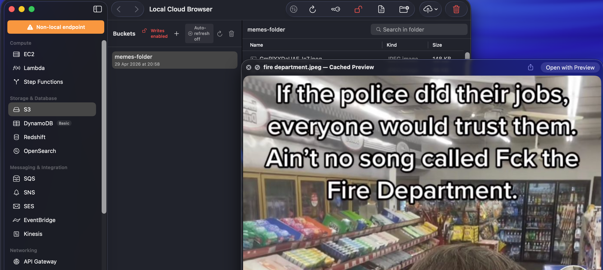

# Local Cloud Browser

A native macOS app for AWS-compatible endpoints, built in SwiftUI. Vibe-coded, local-first, and SigV4 signing is wired in so pointing at real AWS works for everyday browsing.

## What's in it

- 28 services: S3, SQS, SNS, SES, DynamoDB, Lambda, IAM, CloudWatch + Logs, EventBridge, KMS, Secrets Manager, SSM, CloudFormation, API Gateway, ACM, Kinesis, Route53, Redshift, OpenSearch, Step Functions, EC2, STS, Config, Resource Groups, Transcribe, Support
- Connection manager with per-profile credentials (stored in the macOS Keychain)
- Auto-discovery for endpoints running on common local ports
- S3 file browser with Quick Look, multipart upload, ETag-verified preview cache
- Read-only mode by default, toggle in the toolbar
- Per-request IAM permission builder

## Run it

Grab a signed, Apple-notarized build from [Releases](https://github.com/milan0x/local-cloud-browser/releases/latest), or build it yourself.

To build: open `Local Cloud Browser.xcodeproj` in Xcode and hit ⌘R. macOS 14+, Swift 6.

Or from the command line:

```bash
xcodebuild -project "Local Cloud Browser.xcodeproj" -scheme LocalCloudBrowser -configuration Debug build
```




## Status

Free, source-available, no upsell.

Production-ish use against real AWS works, but I'd treat it as a dev/debug companion, not a control plane. The read-only toggle exists for a reason.

## Support

If you find it useful and want to chip in (totally optional, the app is free with full features either way):

| Chain | Address | QR |
|---|---|---|
| BTC | `bc1qx5su0mgr2vtthfwgcvkdsz7mqq7xx936fmv0np` |  |
| USDT (TRC20) | `TFRD6nhY4zFk1KyHQUwiiZMpTYPwyjxZ9N` |  |
| ETH / ERC20 | `0xD6832B71528Dc5Ac2E4e7F33CC1c75A0448A1E9B` |  |
| BNB / BEP20 | `0xD6832B71528Dc5Ac2E4e7F33CC1c75A0448A1E9B` |  |

Backup BTC: `bc1ql2y2v6k5kr40mg2g0l5u3s5lg390nv5s0adqcu`

## License

[PolyForm Noncommercial 1.0.0](LICENSE). Do whatever you want with it as long as you're not selling it or building it into something you're selling. Need a commercial license? Open an issue.

## Contributing

Fine with PRs, no formal process yet. Open an issue first if it's a big change.
