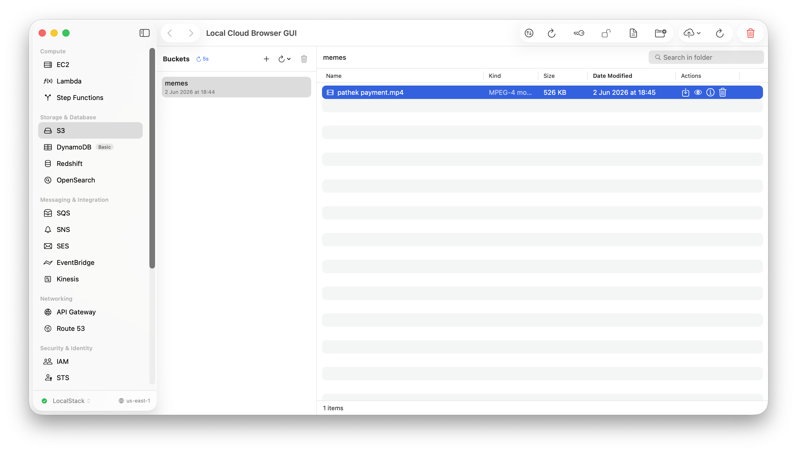

# Local Cloud Browser

A native macOS app for AWS-compatible endpoints, built in SwiftUI. Vibe-coded, local-first, and SigV4 signing is wired in so pointing at real AWS works for everyday browsing.

## What's in it

- 28 services: S3, SQS, SNS, SES, DynamoDB, Lambda, IAM, CloudWatch + Logs, EventBridge, KMS, Secrets Manager, SSM, CloudFormation, API Gateway, ACM, Kinesis, Route53, Redshift, OpenSearch, Step Functions, EC2, STS, Config, Resource Groups, Transcribe, Support
- Connection manager with per-profile credentials (stored in the macOS Keychain)
- Auto-discovery for endpoints running on common local ports
- S3 file browser with Quick Look, multipart upload, ETag-verified preview cache
- Read-only mode by default, toggle in the toolbar
- Per-request IAM permission builder

## Run it

Open `Local Cloud Browser.xcodeproj` in Xcode and hit ⌘R. macOS 14+, Swift 6.

Or from the command line:

```bash
xcodebuild -project "Local Cloud Browser.xcodeproj" -scheme LocalCloudBrowser -configuration Debug build
```



## Status

Free, open source, no upsell. The whole thing was previously gated behind a paid "Unlimited" tier — that's gone. Everything works out of the box.

Production-ish use against real AWS works, but I'd treat it as a dev/debug companion, not a control plane. The read-only toggle exists for a reason.

## Contributing

Fine with PRs, no formal process yet. Open an issue first if it's a big change.
